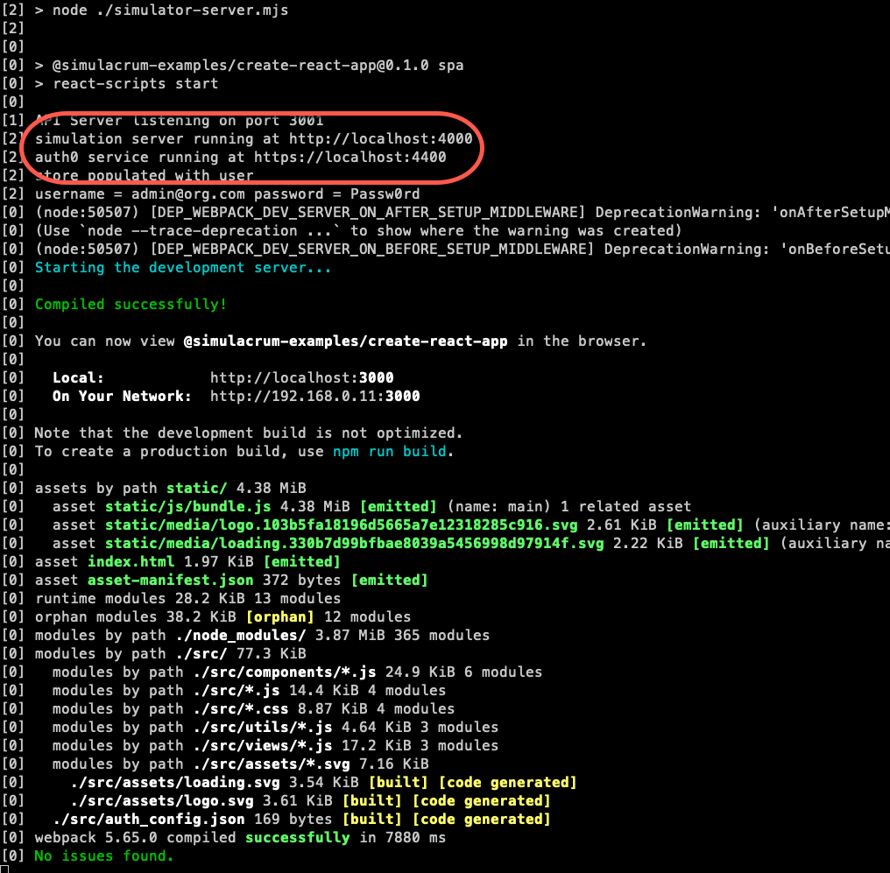
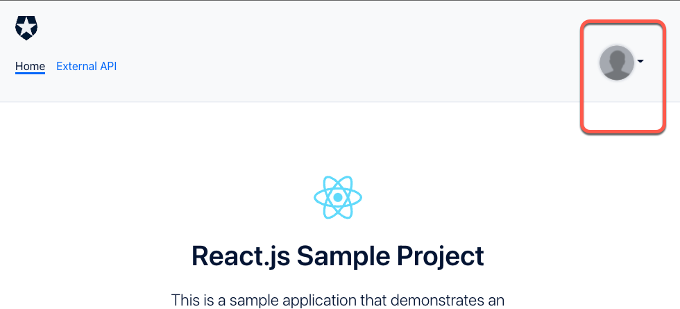

# Auth0 Simulator and @auth0/auth0-react

This sample demonstrates how to use the [auth0-simulator](https://github.com/thefrontside/simulacrum/tree/v0/packages/auth0) and the [Auth0 React SDK](https://github.com/auth0/auth0-react) to authenticate into a React application created using [create-react-app](https://reactjs.org/docs/create-a-new-react-app.html). 

This sample also has [cypress tests](https://github.com/thefrontside/simulacrum/tree/cra-example/examples/create-react-app) that use the [@simulacrum/auth0-cypress](https://github.com/thefrontside/simulacrum/tree/v0/integrations/cypress) addon that has helpers for using the [auth0-simulator](https://github.com/thefrontside/simulacrum/tree/v0/packages/auth0).

## Project setup

Use `npm` to install the project dependencies:

```bash
npm install
```

## Development Configuration

The auth0 configuration to connect to the `auth0-simulator` is defined in the `auth0Simulator` property of the pacakge.json file.

```json
{ 
  "domain": "localhost:4400",
  "clientID": "YOUR_AUTH0_CLIENT_ID",
  "audience": "https://thefrontside.auth0.com/api/v1/",
  "scope": "openid profile email offline_access"
}
```

## Running in development mode

```shell
npm run start:dev
```

A successful start up will output the following to the console:



This will run the [./simulation-server.mjs] file that will start the `auth0-simulator` and create a fake user with the following credentials that can be used to log in.

```
email: "admin@org.com",
password: "Passw0rd"
```

### Auth0 rules
The `auth0-simulator` will run any [auth0 rules](https://auth0.com/docs/rules) that exist in the [./__mocks__/rules](./__mocks__/rules) directory.

One sample rules file, [avatar.js](./__mocks__/rules/avatar.js) exists that adds an avatar when the user logs in:



## Cypress end to end (e2e) testing

### Run the tests

1. In the browser:

```shell
npm run test:browser
```

2. Headless

```shell
npm run test:headless
```

### Silent and universal login tests

The sample cypress end to end tests can be found in the `./cypress/integration` directory.

There are two spec files in that directory that show how to:

1. [login silently](./cypress/integration/login.spec.ts) and run e2e tests

```ts
describe('login', () => {
  describe('login and call an external api', () => {
    it('should get token without signing in and access restricted route',  () => {
      cy.createSimulation(appConfig)
        .given()
        .login()
        .visit('/external-api')
        .get('[data-testid=ping]').click()
        .get('[data-testid=api-message]').should('contain', 'Your access token was successfully validated')
        .url().should('include', '/external-api')
        .logout();
    });
  })
});
```

2. login via the [universal login pages](./cypress/integration/universal-login.spec.ts),

```ts
describe('login', () => {
  describe('Universal Login', () => {
    it('should login', () => {
      let email = 'bob@gmail.com';
      let password = 'Passw0rd!';
      
      cy.createSimulation(appConfig)
        .given({ email, password })
        .visit('/')
        .contains('Log in').first().click()
        .url().should('include', '/login')
        .get('#username')
        .type(email)
        .should('have.value', email)
        .get('#password')
        .type(password)
        .should('have.value', password)
        .get('#submit').click()
        .get('[data-testid=api-link]').should('contain', 'External API')
        .logout();
    });
  });
});
```