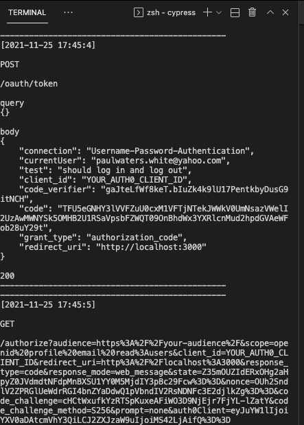

# @simulacrum/auth0-cypress

[Cypress](https://www.cypress.io/) [Auth0](https://auth0.com) addon that simulates an auth0 server running on `localhost` so you don't have to create fake accounts while developing or running tests that require authentication.

## Contents

- [Installation](#installation)
- [Usage](#usage)
  - [createSimulation](#createSimulation)
  - [given()](#given)
  - [login()](#login)
  - [logout()](#logout)
- [debugging](#debugging)
- [examples](./cypress/integration/login.spec.ts)

## Installation

### Step 1: Install the addon

```sh
npm install @simulacrum/auth0-cypress --dev
```

### Step 2: Choose which sdk or javascript sdk (default @auth0/auth0-react)

This plugin supports the following javascript sdks that interface with auth0:

- [@auth0/auth0-react (default)](https://github.com/auth0/auth0-react)
- [nextjs-auth0](https://github.com/auth0/nextjs-auth0)

If you want to use `nextjs-auth0` then you need to set the `AUTH0_SDK` environment variables by any of the [usual cypress environmental varaibles options](https://docs.cypress.io/guides/guides/environment-variables).

e.g. in `cypress.env.json`

```json
{
  "AUTH0_SDK": "nextjs-auth0",
}
```

or as a cypress env var:

```shell
export CYPRESS_AUTH0_SDK=nextjs-auth0
```

### Step 3: Import the commands

```js
// cypress/support/index.js

import '@simulacrum/auth0-cypress';
```

### Step 4: Register the encrypt task

We need to register an encrypt [cypress task](https://docs.cypress.io/api/commands/task).

#### ESM

```js
// cypress/plugins/index.js

import { encrypt } from '@simulacrum/auth0-cypress/encrypt';

export default (on) => {
  on('task', { encrypt });
};
```

#### commonjs

```js
// cypress/plugins/index.js

const { encrypt } = require('@simulacrum/auth0-cypress/encrypt');

module.exports = (on, config) => {
  on('task', { encrypt });
}
```

### Step 5: Configure Auth0

An example [cypress environment file](./cypress.env.json) is in the root of this repo. You can change the configuration to your auth0 values.

```json
// cypress.env.json
{
  "audience": "https://thefrontside.auth0.com/api/v1/",
  "domain": "localhost:4400",
  "clientID": "YOUR_AUTH0_CLIENT_ID",
  "connection": "Username-Password-Authentication",
  "scope": "openid profile email offline_access"
}
```

## Usage

Start the simulator

```shell
PORT=4000 npx @simulacrum/auth0-simulator
```

### Usage with start-server-and-test

Cypress recommends using [start-server-and-test](https://github.com/bahmutov/start-server-and-test) to ensure the test process exits and any servers are shut down.

```shell
npx start-server-and-test 'npm run start:server' http://localhost:3000 \
                      'npm run start:auth0' http://localhost:4000 \
                      cypress:run
```

The following commands are now available in your test suite:

- [createSimulation](#createSimulation)
- [given()](#given)
- [login()](#login)
- [logout()](#logout)

## createSimulation

`createSimulation` creates the fake auth0 server with your configuration

```ts
import auth0Config from "../../cypress.env.json";

describe('tests requiring auth')
  it('should access restricted resource', () => {
    cy
      .createSimulation(auth0Config)
```
## given

`given` creates a fake user that can be used to log into the fake auth0 server.

### create random user

```ts
describe('tests requiring auth')
  it('should access restricted resource', () => {
    cy
      .createSimulation(auth0Config)
      .visit("/")
      .contains("Log out").should('not.exist')
      .given() // with no arguments a random user is created
      .login()
```

### supply fixed fields

```ts
describe('tests requiring auth')
  it('should access restricted resource', () => {
    cy
      .createSimulation(auth0Config)
      .visit("/")
      .contains("Log out").should('not.exist')
      .given({ email: 'bob@gmail.com' })  // fixed fields
      .login()
```

### login()

Call login and logout in your test. For example:

```js
import { Auth0ClientOptions } from '@auth0/auth0-spa-js';
import type { Client, Scenario, Simulation } from '@simulacrum/client';
import { createClient } from '@simulacrum/client';
import config from '../../cypress.env.json';

describe('log in', () => {
  it('should get token without signing in', () => {
    cy
      .createSimulation(auth0Config)
      .visit("/")
      .contains("Log out").should('not.exist')
      .given()
      .login()
      .visit("/")
      .contains("Log out")
      .logout();
  });
});
```

### logout()

```js
cy.logout();
```

`cy.logout` will destroy the simulation and do any clean up between tests like removing an cookies.

## debugging

It is possible to hook up express middleware to log each endpoint that is called and any associated querystring or POST data by simply adding the `debug: true` option when calling `createSimulation`:

e.g.

```js
it("should log in and log out", () => {
  cy
    .createSimulation({ ...auth0Config, debug: true })
```

