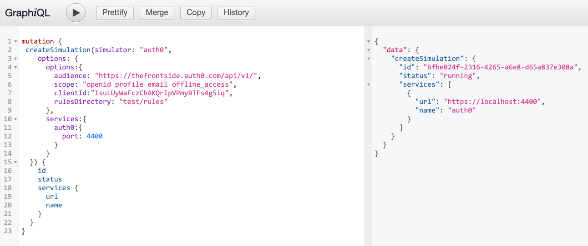
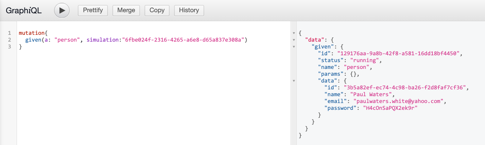

# Auth0 simulator

Read about this simulator on our blog: [Simplified Local Development and Testing with Auth0 Simulation](https://frontside.com/blog/2022-01-13-auth0-simulator/).

## Table of Contents

- [Auth0 simulator](#auth0-simulator)
  - [Table of Contents](#table-of-contents)
  - [Quick Start](#quick-start)
    - [Graphql](#graphql)
    - [Code](#code)
  - [Configuration](#configuration)
    - [Options](#options)
    - [Services](#services)
  - [Rules](#rules)
  - [Endpoints](#endpoints)

Please read the [main README](../../README.md) for more background on simulacrum.

The auth0 simulator has been initially written to mimic the responses of a real auth0 server that is called from auth0 client libraries like [auth0/react](https://auth0.com/docs/quickstart/spa/react/01-login) and [auth0-spa-js](https://github.com/auth0/auth0-spa-js) that use the OpenID [authorization code flow](https://developer.okta.com/docs/concepts/oauth-openid/).

If this does not meet your needs then please create a github issue to start a conversation about adding new OpenID flows.

## Quick Start

This quick start assumes you have your own app with auth0. Check out [`nextjs with auth0 react`](./examples/nextjs-with-auth0-react) and [`nextjs with nextjs auth0`](./examples/nextjs-with-nextjs-auth0) for more complete examples that provides a barebone application.

### Graphql

Let's start our server.

```bash
PORT=4000 npx auth0-simulator  # this will start a test simulacrum server at http://localhost:4000
```

Open a browser at [http://localhost:4000](http://localhost:4000).

This will open a graphql graphiql editor.

Enter the following mutation:

```ts
mutation CreateSimulation {
 createSimulation(simulator: "auth0",
  options: {
    options:{
      audience: "[your audience]",
      scope: "[your scope]",
      clientID: "[your client-id]"
    },
    services:{
      auth0:{
        port: 4400
      }
    }
  }) {
    id
    status
    services {
      url
      name
    }
  }
}
```

This mutation creates your first simulation. Every time you start the server, you will need to apply these mutations. This can also be done programmatically which will be your likely interface while writing tests.

.

Use the values returned from the query to update your configuration in the client application that calls the auth0 endpoints as shown below. This will point your app at the simulation instead of the Auth0 endpoint.

```json
{
  "domain": "localhost:4400",
  "clientID": "00000000000000000000000000000000",
  "audience": "https://your-audience/"
}
```

Create a fake user whose credentials can be used for authentication with this query.

```graphql
mutation CreatePerson {
  given(a: "person", simulation: "6fbe024f-2316-4265-a6e8-d65a837e308a")
}
```



The fake user can now be used on your app. Use the `email` and `password` fields as login credentials.

You now have a running auth0 server!

### Code

An auth0 simulator can be created using the `@simulacrum/client` package. This is how you would apply the mutations programmatically.

```bash
npm install @simulacrum/client
npm install @simulacrum/auth0-simulator
```

The following examples are written in Typescript, but using Typescript is not a requirement. The Auth0 simulator creates a server with a graphql interface. This means that your interactions with the server can be written in any language or framework that can communicate over http / graphql.

```ts
import { main } from "effection";
import { createSimulationServer, Server } from "@simulacrum/server";
import { auth0 } from "@simulacrum/auth0-simulator";
import { createClient } from "@simulacrum/client";

const port = Number(process.env.PORT) ?? 4000; // port for the main simulation service

// effection is a structured concurrency library and this will help us handle errors and shutting down the server gracefully
main(function* () {
  let server: Server = yield createSimulationServer({
    seed: 1,
    port,
    simulators: { auth0 },
  });

  let url = `http://localhost:${server.address.port}`;

  console.log(`simulation server running at ${url}`);

  let client = createClient(url);

  let simulation = yield client.createSimulation("auth0", {
    options: {
      audience: "[your audience]",
      scope: "[your scope]",
      clientID: "[your client-id]",
    },
    services: {
      auth0: {
        port: 4400, // port for the auth0 service itself
      },
    },
  });

  console.log(`auth0 service running at ${simulation.services[0].url}`);
  let person = yield client.given(simulation, "person");

  console.log(`store populated with user`);
  console.log(
    `username = ${person.data.email} password = ${person.data.password}`
  );

  yield;
});
```

The `client` is also expected to be run in many different contexts, and, as such, supports async/await as well.

```js
import { main } from "effection";
import { createSimulationServer } from "@simulacrum/server";
import { auth0 } from "@simulacrum/auth0-simulator";
import { createClient } from "@simulacrum/client";

const port = Number(process.env.PORT) || 4000; // port for the main simulation service

main(function* startServer() {
  // the simulation server needs to run within the scope
  // of an effection context
  let server = yield createSimulationServer({
    port,
    simulators: { auth0 },
  });

  let url = `http://localhost:${server.address.port}`;

  console.log(`simulation server running at ${url}`);

  yield setupClient({ url });
});

// the client is expected to run anywhere and does not expect
// the effection scope, as such, it also can be used with async/await
async function setupClient({ url }) {
  let client = createClient(url);

  let simulation = await client.createSimulation("auth0", {
    options: {
      audience: "https://your-audience/",
      scope: "openid profile email offline_access",
      clientID: "YOUR_AUTH0_CLIENT_ID",
    },
    services: {
      auth0: {
        port: 4400, // port for the auth0 service itself
      },
    },
  });

  console.log(`auth0 service running at ${simulation.services[0].url}`);

  let person = await client.given(simulation, "person");

  console.log(`store populated with user`);
  console.log(
    `username = ${person.data.email} password = ${person.data.password}`
  );
}
```

## Configuration

Both the graphql `createSimulation` mutation and the `@simulacrum/client` take an optional `options` and `services` object.

```ts
// A snippet from the previous `Code` example.
let simulation = yield client.createSimulation("auth0", {
  options: {
    audience: "[your audience]",
    scope: "[your scope]",
    clientID: "[your client-id]",
    rulesDirectory: "test/rules",
  },
  services: {
    auth0: {
      port: 4400,
    },
  },
});
```

### Options

The `options` field supports the [auth0 configuration fields](https://auth0.com/docs/quickstart/spa/vanillajs#configure-auth0). The option fields should match the fields in the client application that is calling the auth0 server.

An optional [`rulesDirectory` field](#rules) can specify a directory of [auth0 rules](https://auth0.com/docs/rules) code files, more on this [below](#rules).

### Services

The `services` object configures simulators to start on specific ports.

```ts
let simulation = yield client.createSimulation("auth0", {
  options: {
    services: {
      auth0: {
        port: 4400,
      },
    },
  },
});
```

## Rules

It is possible to run [auth0 rules](https://auth0.com/docs/rules) if the compiled code files are on disk and all located in the same directory.

Set the `rulesDirectory` of the [options field](#options) to a path relative to your current working directory.

For example, a [sample rules directory](./test/rules) is in the auth0 package for testing.

If we want to run these rules files then we would add the `rulesDirectory` field to the [options object](#options).

```ts
let simulation = yield client.createSimulation(url, {
  options: {
    rulesDirectory: "test/rules",
  },
});
```

## Endpoints

The following endpoints have been assigned handlers:

- `/authorize`
- `/login`
- `/u/login`
- `/usernamepassword/login`
- `/login/callback`
- `/oauth/token`
- `/v2/logout`
- `/.well-known/jwks.json`
- `/.well-known/openid-configuration`
